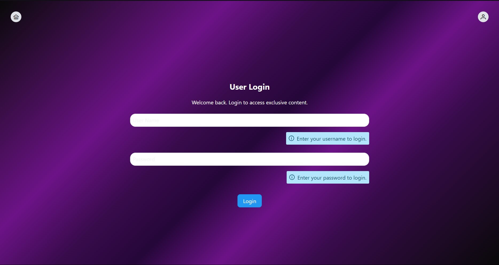
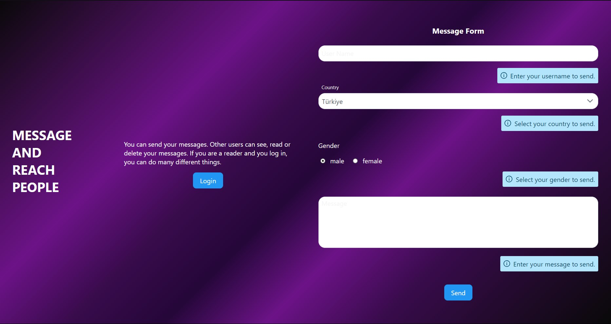
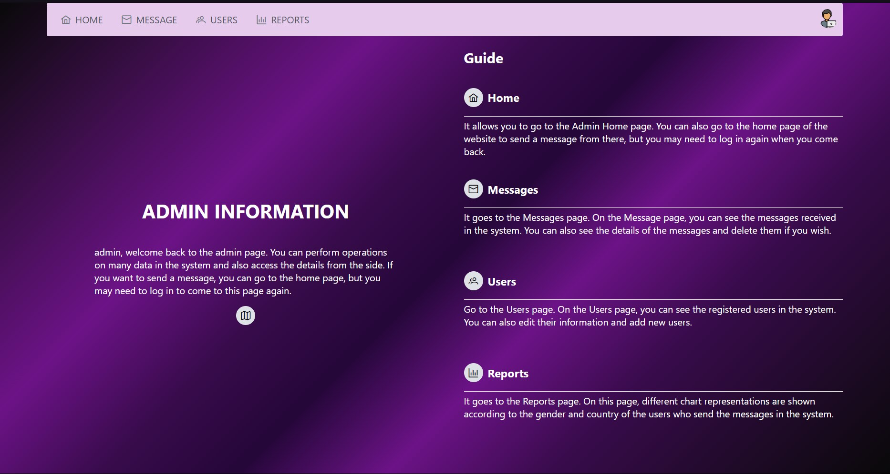
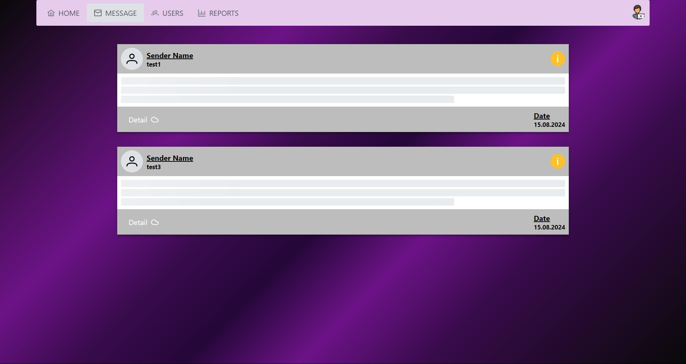
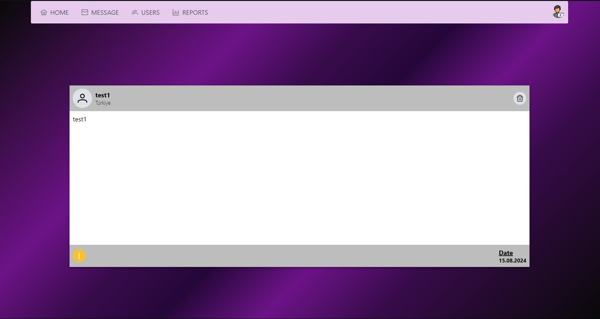
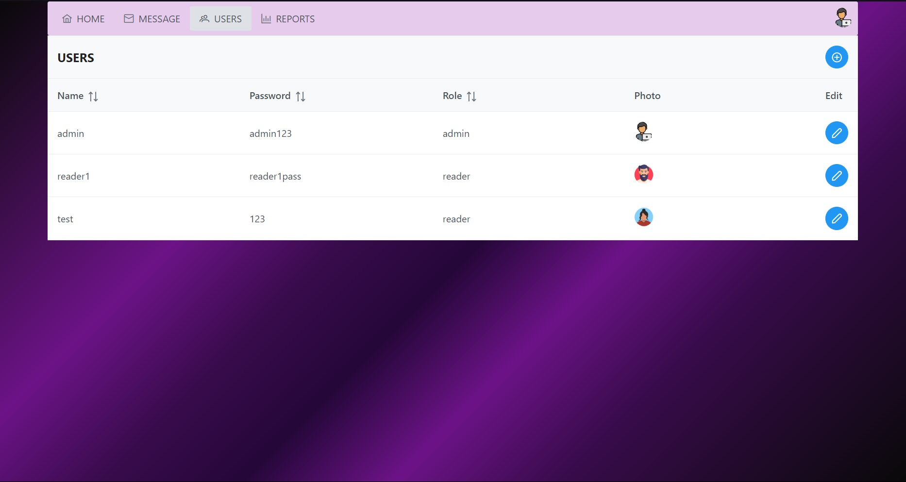
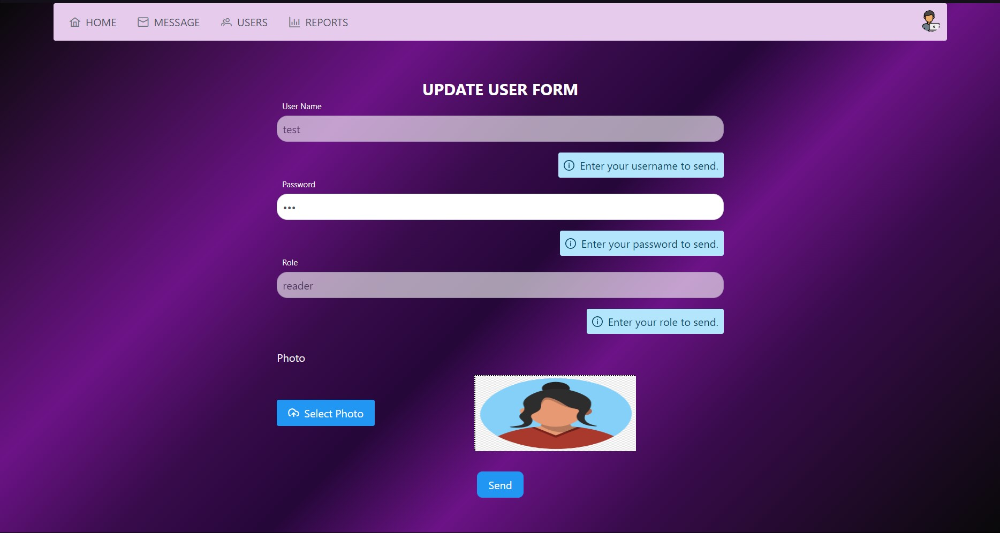
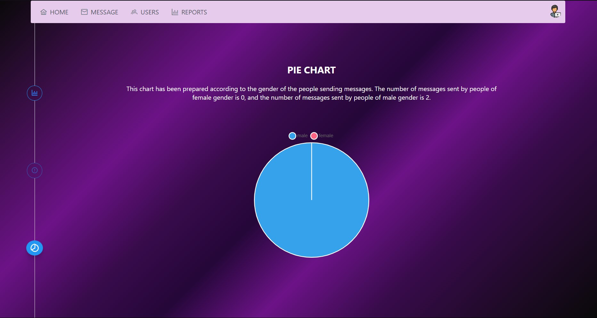
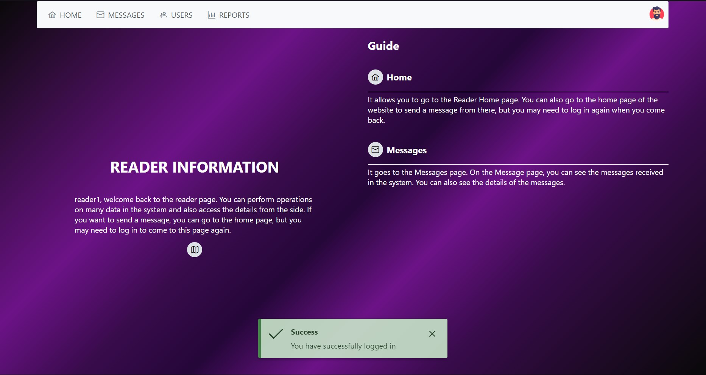
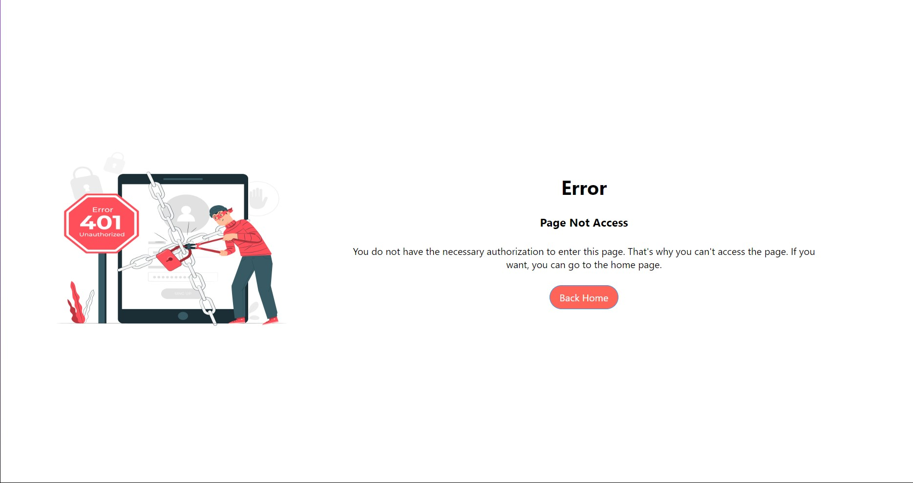

# Contact Form Management System

## Project Overview

This project of mine is a Contact Form Management System project.The frontend of this project is Vite, and the backend is Node.js.
I used libraries for some features in this project:
- react-router-dom for application router
- react-redux for state management
- reactprime for style
- For charts, I downloaded and used libraries such as chart.js as npm install lib_name.
There are two different user types in the project, and there are areas where these users can access and interact differently.
Fields in application:
- We can add and edit users in the user field.
- In the message section, we can see, read and delete messages.
- In the reports section, the representations of some data on the chart are shown.
In these areas, users will be able to perform certain operations or not depending on their role.
In general, we can send messages in the project without registering to the system, and if we are registered, we can enter the system and perform existing transactions.
 

## Project Images

